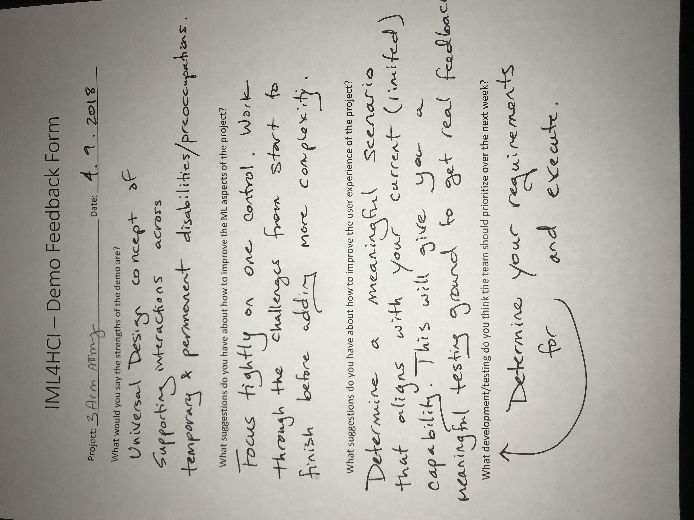

# Changelog

## Week 1 - 3/19

### Finalized idea
We decided we will be creating a robotic arm that has a set of pre made motions that will be triggered by the users trained gesture. We submitted our revised project proposal.

### Research and Design
- Added example code for motor driver
  - Added classes for motorDriver, motor
  - Outline for armDriver class
  - Tested Kinect functionality with Processing
  - Wrote Python Script to send OSC


## Week 2 - 3/26
### Arm Development
  - Fixed classes to drive the motor constantly
    - Will add OSC next to allow us to drive the motor from a different program
  - Added basic OSC forwarding to the arm driver ```armDriver/arm.py```
    - Pushing to teopest on Raspberry Pi
    - Got OSC messages to be received from computer

### Python OSC
  - Created a simple Python OSC Client that forwards messages to Wekinator

### Kinect & Processing
  We created a 2 class classifier that detects if the user's left arm is reaching up towards his or her left shoulder.
  - Experimented with inputs from Kinect and used [SimpleOpenNI](https://github.com/wexstorm/simple-openni), a library that tracks body joints and angles.
  - Used Processing to get Kinect Data and forwarded info to Wekinator
    - Planning to forward classification Wekinator provides to our Python OSC component to drive the motors

We experimented with Kinect because we thought that our robotic helper hand would fit perfectly on one's shoulder. Kinect would allow us to sense when a user is reaching for a the arm sitting on his or her shoulder by measuring the angle of the elbow.

Cleaned up demo to work correctly with the Raspberry Pi and OSC messages. Currently one motor is being driven, and now the rest of the motors will be bootstrapped forward with the classes we already wrote.

[Kinect Classification Video](https://www.youtube.com/watch?v=aPeoNjqThVM)


[Connecting OSC Messages to Arm Movement](https://www.youtube.com/watch?v=1SC9NRHUd_s&feature=youtu.be)

## Week 3 - 4/2

### Adding Of More Motor
  - Added Center Motor to the Software and wired it up to run - RC
    - Two motors correctly work hard ware and Software - RC
  - Running out of wires and its getting messy so we ordered a PI GPIO extender to make it more managable - RC

### Smooth Motor
  - Removed the sleep function so now motors turn on or off - RC
  - Added a stop motor function in the motor and motorDriver classes - RC

### Get the Myoband Working
  - Got the Myoband connected to a processing application using a Myoband library - AU
  - Mapped default Myoband motions to different OSC signals to work with the arm - AU

### Get the Microbit working
  - Microbit working when attached to calve - RP
  - Used program from Wekinator website to get accelerometer inputs to wekinator - RP
  - Attached microbit to an armband that should work for different peoples legs -RP

 [Myo Band With Arm Video](https://youtu.be/kdE6L6RaleA)

 ## Week 4 - 4/9

 ### Feedback
 


 ### Adding Of More Motor
  - Parts came in and converted what we had to work with new parts - RC
  - All 4 motors currently work hardware and software wise - RC
    - IMPORTANT - while all 4 motors can run at the same time its not advised as it makes them run very slow. - RC
